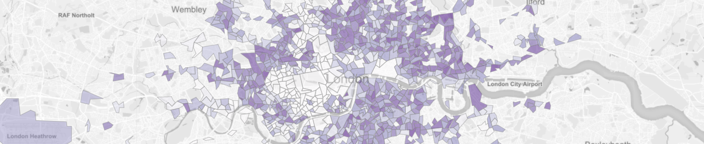
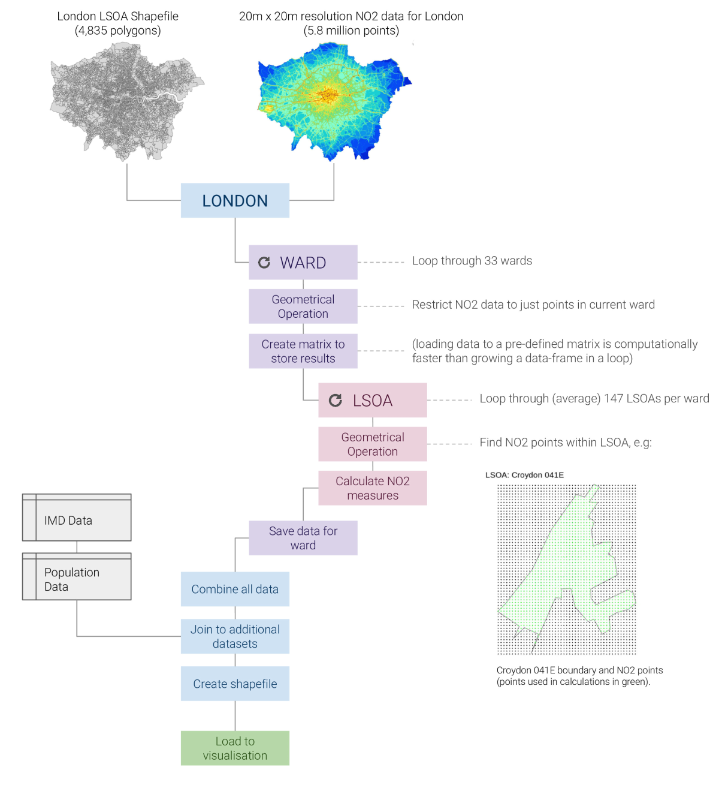
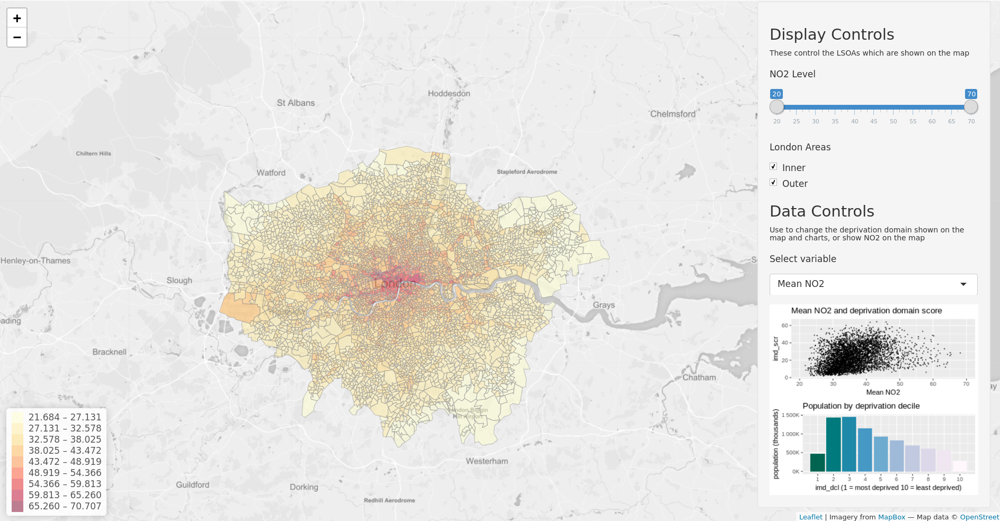
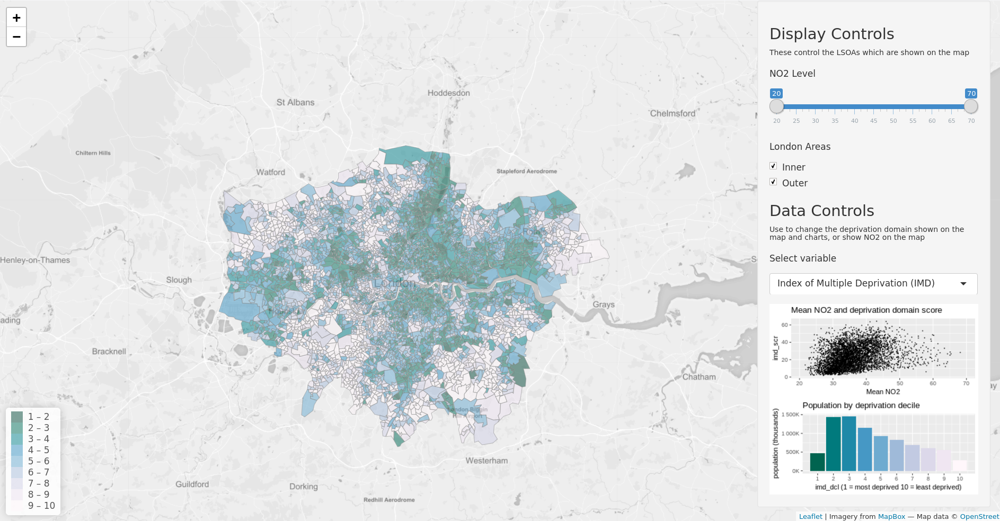
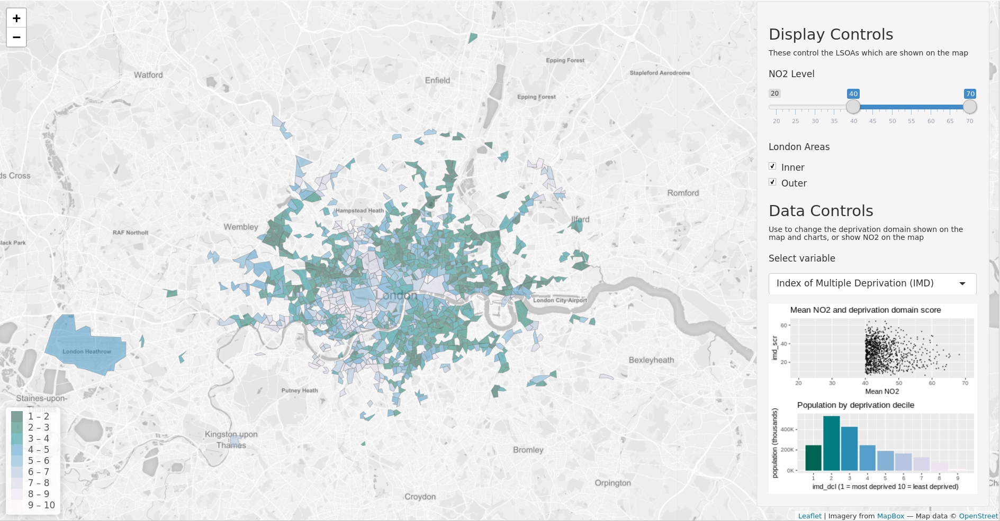
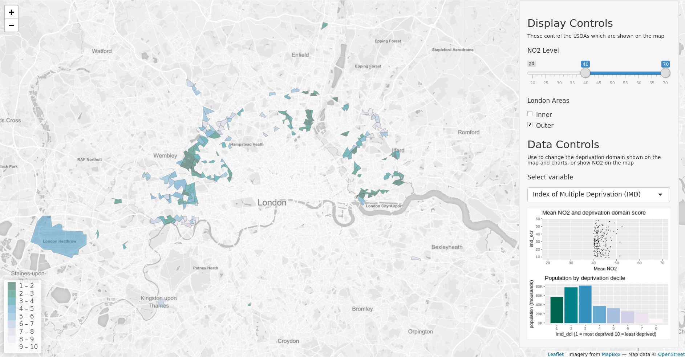
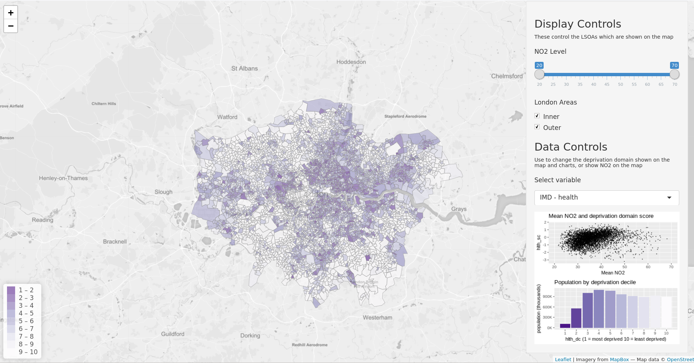

# [London Air Pollution Exposure & Inequality](https://greg-slater.shinyapps.io/shiny_app/)
## Context

The global burden of disease and risk factors study of 2015 identifies air pollution as the fifth-leading global risk to population health (GBD, 2015). Earlier work by the same group estimated that in 2013, 87% of the world’s population resided in areas above the WHO guidelines for safe concentration levels of ambient particulate matter (PM2.5), and that between 1990 and 2013 there was a rise of 20.4% and 8.9% in PM2.5 and Ozone global concentrations respectively (Brauer et al., 2013).

Alongside the research investigating health impacts of high pollution is a growing body of work examining how these impacts vary amongst different populations. In the U.S. the term ‘environmental injustice’ has been used to describe this phenomenon (Clark et al., 2014: p1), and in Europe a WHO review of evidence concluded that those living in adverse socio-economic conditions could suffer twice as much from environmental exposures as wealthier neighbours (WHO, 2010). Examining air pollution specifically, the authors identified two mechanisms which may drive inequality: differential exposure, whereby disadvantaged groups are more exposed to high levels of pollution; and differential susceptibility, whereby disadvantaged groups are more susceptible to resultant health effects.

While there is clear evidence for differential susceptibility (WHO, 2010), the patterns of differential exposure are less clear. In their study of Rome, Forastiere et al. (2007) found that the desirability of living centrally meant that high Socio-Economic-Status (SES) groups were most exposed to high levels of pollution, but they were not affected in health terms by pollution compared to lower SES groups. In a study of the Netherlands and England Fecht et al. found that while the highest levels of pollution were often found in the most deprived communities, the relationship between the spatial distribution of these communities and air pollution levels were “more complex, and less universal than often implied” (Fecht et al., 2015: p201). There are clearly many factors influencing both of these spatial patterns, making any relationship between them both complex and highly dependent on the study area.

Research carried out for the Greater London Authority (GLA) investigated inequality in air pollution exposure in London (GLA, 2013; 2017a), finding that of the 1.9m people exposed to annual average NO2 concentrations above the EU limit value of 40 micrograms/m3, 32% belonged to the most deprived groups compared to only 7% from the least. This research does well in describing some of the differences in exposure between more and less deprived populations in London, but did not fully deliver in describing the spatial characteristics of these patterns.

## Aims

Researchers of air pollution in London are fortunate in having access to very detailed pollution model data for Greater London in the form of the London Atmospheric Emissions Inventory (LAEI) (GLA, 2017b). However, the scale and format of the dataset makes working with it challenging. Furthermore, recent research by the GLA into differential exposure is limited in the mapping of patterns of pollution and deprivation together. As such, the aims of this project are twofold:

Use open-source tools to create a process that can turn the LAEI data into more adaptable formats, which can in turn be linked and compared to further datasets.

Develop an interactive visualisation tool which allows users to explore the patterns of air pollution and deprivation in London.

## Methodology

### Data

The LAEI uses 31 emissions sources varying from point (e.g. known industrial emitters), line (e.g. transport) and area (e.g. aviation, agriculture, landfill), which are combined into overall emissions estimates of four key pollutants at 20m resolution for the whole of Greater London. This high resolution data guarantees as much accuracy as possible and flexibility in the spatial scale chosen for analysis. This project uses the NO2 dataset - the GLA found that concentrations of other pollutants varied less between areas but followed the same pattern as NO2 concentration, making NO2 a good proxy for general air pollution levels (GLA a, 2017). The most recent model data for 2013 will be used to allow direct comparison to other data for that year.

A common challenge working with air quality data is combining datasets of a different spatial nature (Ivy et al., 2008). This is true here as the LAEI data is point and any deprivation measure is likely to be areal. So to be useable the LAEI dataset must be aggregated to areal units, which raises the challenge of the scale part of the Modifiable Areal Unit Problem, whereby variation in the source data is lost as it is aggregated to a higher spatial level (Wong, 2009). In their study of the effectiveness of deprivation indices at different spatial scales Shuurman et. al. (2007) conclude that problems caused by MUAP are best combated by working at the smallest unit of analysis possible. In this case that is a Lower Super Output Area (LSOA), which is a group of Output Areas - the lowest geographical level at which census data is provided (ONS, 2011). LSOAs represent populations of 1,000 - 3,000 people and there are a total of 4,835 in London.

For England there exists a comprehensive measure of deprivation in the form of the English Indices of Deprivation. These indices measure deprivation for LSOAs across seven domains, and these domains are in turn combined with different weightings into a single overall index of deprivation (Ministry of Housing, Communities & Local Government, 2015). This dataset is granular enough to show spatial patterns across London, and the availability of the domain data means users of the end tool will be able to explore the makeup of populations affected by poor air-quality at a high level of detail.

### Tools

R was chosen as the primary tool for the key benefit of being able to share the entire workflow for the project in a transparent way. It is also capable of handling the large NO2 point dataset; QGIS crashed attempting to load and display the ~5.8m points. Additional packages add further benefits: sf for a brilliant framework and toolset for handling spatial data, as well as Shiny and Leaflet for their excellent interactive display capabilities.

### Workflow
Working with the large dataset was still challenging in R; the looping process described in fig. 1 brought total processing time down to 1 hour from an estimated 24 hours using the full dataset.

figure 1

### Design
The key objective of the design was to allow users to gain insight from the interaction of NO2 and deprivation data. The use of a location quotient to display the deprivation data was tested but ultimately judged to be difficult to interpret on the map. This is because the display then becomes contingent on the mean London deprivation score for that domain. This mean varies by domain and makes comparison across them challenging. The decile for each LSOA was instead chosen as the most consistent indicator of ‘most’ to ‘least’ deprived areas. Interaction between the two datasets comes from users selecting the LSOAs to display by NO2 level, and the deprivation domain to map onto these LSOAs. The analytical focus was shifted to straightforward but insightful descriptive statistics that allow users to explore how the chosen population varies in terms of deprivation compared to London overall.

## Results & Discussion

Using the tool to examine the NO2 patterns in London, we see what is probably expected: that high levels of air pollution are concentrated in the centre of the city, and in bands around major roads in outer London (fig.2). Switching the map to the Index of Multiple Deprivation (fig.3) shows a much more diverse pattern; London becomes a mosaic of clusters of both high and low deprivation scores, though we can see from the decile chart that overall the distribution is skewed towards the more deprived lower deciles. However, when limited to areas over the EU NO2 limit of 40 micrograms/m3 (fig.4) this pattern becomes far more marked, with populations in the least deprived deciles almost completely vanishing. The difference in the number of people in high or low deciles affected by these high levels of pollution is dramatic and implies that London does follow a pattern of differential exposure. This pattern becomes even more obvious when limited to just outer London (fig.5), suggesting that when the desirability of central location is removed differential exposure might become even stronger.

   
*figure 2*
   

   
*figure 3*
   

   
*figure 4*
   

   
*figure 5*
   
In some of the other deprivation domains there are such strong patterns for London overall that it is difficult to discern any change as the NO2 level changes; crime, housing barriers and living environment are almost entirely in the lower deciles for the whole of London, reflecting some of the general challenges of living in a major city. Employment and income show a similar pattern to overall IMD, with London skewed towards the lower deciles with the pattern and the pattern amplified for high pollution areas.

Some of the most interesting patterns can be found in the health domain. Unlike the other indicators it is very skewed towards the least deprived deciles for London overall (fig.6), but this pattern almost completely flips when limited to high pollution areas (fig.7). On the map we see that some of the highest pollution areas have the best health scores, but the majority of the affected population sits in the most deprived deciles. This pattern shows how vulnerability to the health dangers of air pollution may vary across the exposed population, as is suggested by WHO’s research into differential susceptibility (2010).
   

   
*figure 6*
   
### Developments 

The great detail in LAEI data can give the impression of great accuracy, but there is very little information available about how the model is built, making it difficult to factor any assumptions into conclusions here. It is also worth considering that mean NO2 may not be very representative of the actual pollution experienced by the population in some areas; e.g. an LSOA dominated by park area will likely have a lower mean NO2 level than the level closest to houses and roads. However, this small generalisation should be acceptable in this application to show high level trends. Investigation could be developed further by adding different pollutant data, and considering how to best use the 2020 model data. Fecht et al. (2015) highlight how in their research the association between environmental risk factors and socioeconomic indicators varied depending on the pollutant and measure of SES, showing the importance of validating conclusions with additional data, particularly in any statistical analysis.

The application could be developed further with more statistics or measures. Particularly useful would be a dynamic comparison of the selected population to the London or England population overall. This would require some thoughtful development to handle calculations efficiently and without error. Adding in a selection field for boroughs would be a simple task and could make this a useful tool for London councils. Readability or interaction with the data could also be improved by highlighting major roads, ward boundaries and even adding hover-over data to LSOAs.

Overall, the application certainly succeeds in providing interactive way to engage with the data and understand high level patterns or possible areas for further more detailed research; the stark differences in the health domain scores of the exposed population certainly suggests further research would be valuable. Making any conclusions about causality, however, is difficult. Indeed, it is not clear whether some of the suggested links between deprivation and air pollution are caused by these factors or rather linked to factors which affect conditions in the centre of the city in general, such as housing and the legacy of London’s development. What is clear though is that air pollution appears to disproportionately affect more deprived populations in London, and this warrants further investigation and attention from policy makers.

    

## References   
 

---
nocite: | 
@brauer_ambient_2016, @clark_national_2014, @fecht_associations_2015, @forastiere_socioeconomic_2007, @gbd_2015_risk_factor_collaborators_global_2016, @gla_analysing_2013, @gla_london_2017, @gla_updated_2017, @ivy_development_2008, @ons_census_2011, @schuurman_deprivation_2007, @wong_modifiable_2009, @world_health_organisation_environment_2010

...
